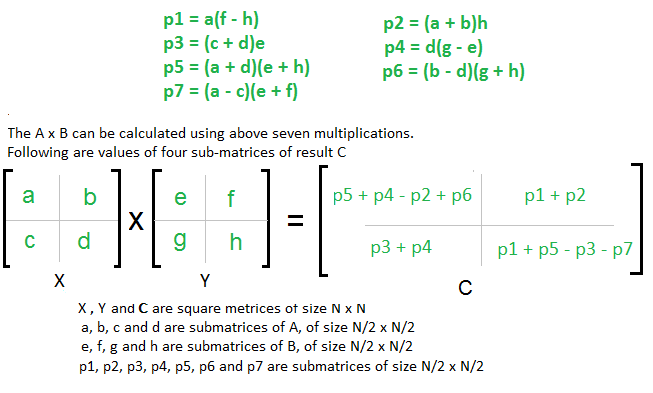
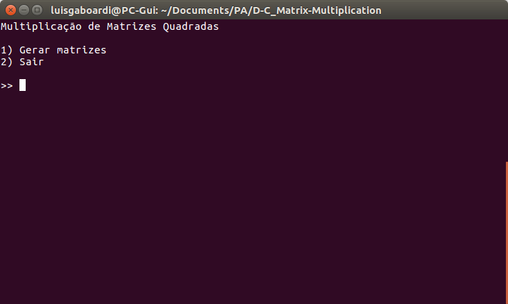
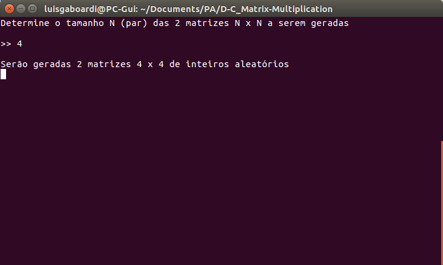
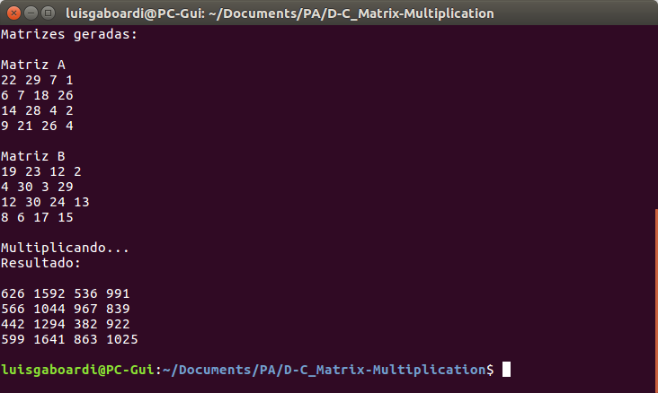

# Strassen's Matrix Multiplication

**Número da Lista**: 5 
**Conteúdo da Disciplina**: Divide and Conquer 

## Alunos
|Matrícula | Aluno |
| -- | -- |
| 18/0022962  |  Lus Guilherme Gaboardi Lins |

## Sobre
Dadas duas matrizes quadradas A e B de dimensão n x n, a multiplicação entre elas A*B (ou B*A) utilizando o procedimento padrão nos dá uma complexidade de O(N³).
O algoritmo de multiplicação de Strassen é um método recursivo que divide uma matriz em 4 sub-matrizes de dimensões n/2 x n/2 a cada passo recursivo. A complexidade é então reduzida para aproximadamente O(N^2.8), que para uma entrada grande, faz diferença significativa.

   

## Screenshots

   
   
   

## Pré-Requisitos
Compilador GCC, ambiente capaz de executar arquivos .c

## Instalação 
**Linguagem**: C 

### Linux

No terminal, escolha o local no qual a pasta será instalada e execute:

1. `git clone https://github.com/projeto-de-algoritmos/D-C_Strassen-Matrix-Multiplication.git`
2. `cd Greed_Knapsack-Problem`

Ou

1. Faça o download do projeto zipado a partir do GitHub
2. Descompacte a pasta no destino _path_ escolhido
3. Utilizado o terminal, acesse o local onde a pasta foi descompactada
4. `cd path/D-C_Matrix-Multiplication

Para executar:

1. `gcc strassen.c -o prog`
2. `./prog`

## Uso

1. ReadMe e instruções de execução:- 

